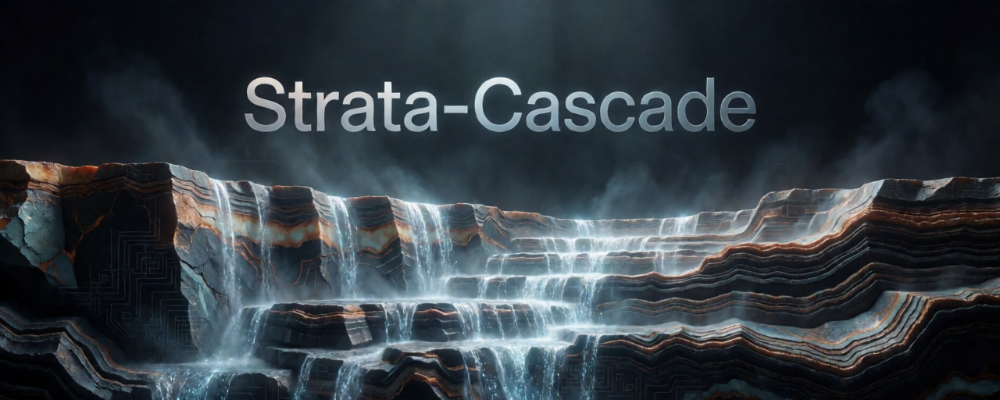

<p align="center"></p>

<h1 align="center">Strata-Cascade</h1>

<p align="center"><b>Run a 125-billion-parameter AI model FASTER on a 32 GB RAM, 16 GB VRAM PC and possibly smaller - even when its experts do not fit in RAM.</b></p>

<p align="center">
  
  
  
  
  
  
</p>

Strata-Cascade is a fork of **[Niko1221/Strata](https://github.com/Niko1221/Strata)**. Upstream already streams a
model too big for your RAM from the SSD; this fork goes further and **uses every fast place at once** - both graphics
cards, a page-locked slice of system RAM, and the SSD - so a machine whose RAM cannot hold the experts keeps
generating at 128K context instead of collapsing into the page file.

> [!IMPORTANT]
> Everything upstream already does - the installer, the app, the API, every model size, AMD and multi-GPU support -
> is **unchanged**. This fork only adds the cascade. If you already run upstream Strata, you can keep your existing
> files: **[see below](#already-run-upstream-reuse-your-files)**.

## What this fork solves

A 125B model's experts are ~24 GB in [Qwen3.8-Flash-Next IQ3_XXS](https://huggingface.co/ISTA-DASLab/Qwen3.8-Flash-Next-GSQ-RCO-GGUF/tree/main/IQ3_XXS).
On a 32 GB PC, upstream must either keep them in RAM (no room) or stream every miss from the SSD - so the experts
either do not fit or the answer stalls on the disk. That is the exact case this fork fixes:

- **Every tier at once.** The experts are split across VRAM, a page-locked slice of RAM and the SSD - and, with a
  second card present, a helper cache that upstream **refuses to combine with the RAM tier at all**.
- **RAM that stays locked.** The hottest remaining experts live in a **page-locked budget**, so throughput stops
  depending on whether the OS file cache happens to be warm.
- **The SSD off the critical path.** Cold experts stream **ahead of the CPU**, a ring of reads in flight, instead of
  blocking on each miss.
- **A machine that stays usable.** The optional **memory guard** makes the engine the cheapest victim when RAM runs
  short, instead of paging *your* apps to a slow disk. Turning that churn into clean, file-backed pages it can drop
  rather than write out **could also mean less SSD wear** (how much depends on your system and what else is running).

## Why it runs faster

**What this build is:** upstream Strata **v0.1.39** (`origin/main` `6f32ec0`) plus the cascade port - the *same* upstream
base, so the numbers below isolate the fork and nothing else. Two ideas do the work, and both show up as raw numbers (same PC, same model,
same context - full method in [`STRATA-CASCADE.md`](STRATA-CASCADE.md)):

**Test rig:** AMD Ryzen 7 5800X, 32 GB DDR4-3600, RTX 5060 Ti 16 GB + RTX 3060 12 GB (PCIe 4.0 x8/x8),
SK hynix P41 2 TB (PCIe 4.0) SSD, Windows 11.

| What changed | Stock upstream | Strata-Cascade | |
| --- | ---: | ---: | --- |
| **Decode** - writes answers | 42.5 t/s | **51.8 t/s** | **1.2x** |
| **Prefill** - reads your prompt | 253 t/s | **900 t/s** | **3.6x** |

The cascade's win is not the cache hit rate: upstream's newer cache path (`--remote-expert-opt`, on in the stock
arm) brings stock to the same ~87% (see **Results**). It is **keeping the SSD reads in flight** and **spending
every tier once**:

- **Prefetch, don't stall.** A ring of up to ~48 SSD reads stays in flight while the GPU computes the previous
  layer. Upstream beside a helper reads each miss synchronously - which is why its prompt reading stalls at 253 t/s.
- **Spend every tier once.** `settle` sorts each expert into exactly one of VRAM / pinned RAM / SSD, so no expert is
  duplicated on a card and in RAM, and the pinned budget goes only to blobs *no* GPU computes.

## Results

**Qwen3.8-Flash-Next IQ3_XXS, 128K context** (8-bit KV), 32K prompt / 5K reply,
vision on. Both current arms are fresh builds of the **same** upstream base (v0.1.39, `origin/main` `6f32ec0`), one
run each, on the same PC (AMD Ryzen 7 5800X, 32 GB DDR4-3600, RTX 5060 Ti 16 GB + RTX 3060 12 GB over PCIe 4.0 x8/x8,
SK hynix P41 2 TB SSD, Windows 11). The model is ISTA-DASLab's [IQ3_XXS quant](https://huggingface.co/ISTA-DASLab/Qwen3.8-Flash-Next-GSQ-RCO-GGUF/tree/main/IQ3_XXS)
of [Qwen3.8-Flash-Next](https://huggingface.co/Qwen/Qwen3.8-Flash-Next) - the exact one setup downloads:

| Config | Decode | Prefill | Cache hit |
| --- | ---: | ---: | ---: |
| Upstream, dual-GPU (`--mmap-experts` + CUDA1 helper + `--remote-expert-opt`) | 42.5 t/s | 252.9 t/s | 87.4% |
| **Strata-Cascade, 2 cards + memory guard** | **51.8 t/s** | **900.5 t/s** | **86.2%** |
| Strata-Cascade, 1 card (`--low-ram tiered`) | 28.2 t/s | ~960 t/s | 38% |
| Upstream, low-RAM mode, 1 GPU (`--resident-experts`) | 7.6 t/s \* | ~200 t/s \* | 37% |

\* Upstream's one-card mode at this context **thrashed the pagefile and froze the PC** (826 s for one 5K reply); with
a warm OS file cache it posts 29.7 t/s / 434 t/s, so it lives or dies by the page cache. The cascade does not - its
RAM budget is *pinned*.

The current best two-card run adds the **memory guard** (see
[`STRATA-CASCADE.md`](STRATA-CASCADE.md#the-memory-guard-opt-in)) to the layout above: 51.8 t/s decode / 900.5 t/s
prefill / 86.2% hit, the fastest measured here. It is a single run; the guard's measured job is to keep the machine
usable, not to add throughput.

> [!NOTE]
> Measured on **Windows 11** (AMD Ryzen 7 5800X, 32 GB DDR4-3600, RTX 5060 Ti 16 GB + RTX 3060 12 GB over PCIe 4.0
> x8/x8, SK hynix P41 2 TB SSD). The Linux path is
> implemented but **not yet measured** - please share your numbers. Rig, method and every figure:
> [`STRATA-CASCADE.md`](STRATA-CASCADE.md).

## Compatibility

Exactly what upstream needs - **nothing extra to install**:

| | |
| --- | --- |
| **Graphics card** | **16 GB of VRAM or more** - a 16 GB card alone is the setup shown here; a **second card is optional and adds speed**, and **less VRAM works, just slower**. Either both NVIDIA or both AMD ([upstream's card list](#what-you-need)) |
| **RAM** | **32 GB or more**; the less you have, the more the cascade helps |
| **System** | **Windows** or **Linux**; **NVIDIA-only or AMD-only** (no mixed setups) |
| **Disk** | an SSD matters more here - the cold experts stream from it |

The cascade earns its keep only when the experts **do not fit RAM**. **One card works** (the setup shown above); an
optional **second GPU holds a helper cache** and is where the biggest extra speed comes from - and **more VRAM means
more speed**, since more experts stay resident. A big card with enough RAM (e.g. a 3090 24 GB with 64 GB) needs no
cascade at all.

## Install

> [!TIP]
> **Already run upstream Strata?** Skip to [Reuse your files](#already-run-upstream-reuse-your-files) - it will not
> re-download anything.

### The easy way (recommended)

Download or `git clone` this fork, then run:

- **Windows:** double-click **`START-HERE.bat`**
- **Linux:** `./setup.sh`

It is the **same installer and walkthrough as upstream**: it checks your PC, asks a few questions (each with a
recommended default - just press Enter), downloads the model (~70 GB, resumable), prepares it, and starts the app at
`http://127.0.0.1:8080`. Want to see what it thinks of your PC first, without installing anything? Run it with
**`--check`**.

Setup writes your machine's settings to **`strata-<model>.json` in the Strata folder** - that is where the cascade
flags live, and what the tuner and the server read.

**The cascade turns on by itself** when *all* of these are true:

1. you are running this fork's engine, **and**
2. the model's experts do **not** fit your RAM (the same test that picks upstream's low-RAM mode), **and**
3. your PC has a **second usable graphics card** (it becomes the helper cache).

**On a single card, setup asks** (it recommends **yes**) - the cascade pins what RAM allows and streams the rest,
without the helper's extra speed. If RAM holds the whole model, no cascade is offered (there is nothing to gain). Force
it on with `--low-ram tiered`, off with `--low-ram resident` or `--low-ram off`. Setup configures the cascade flags for
you and prints them - the other cascade *prompt* is at the end, where it **offers** to tune the layout (it defaults to
**No**; you can run it any time - see [Tuning](#tuning-both-systems)).

### Build the engine yourself

The ready-made engine covers RTX 20/30/40/50; build from source if your card is outside that list, you are on AMD, or
you want to hack on the cascade.

The easy way is to let setup do it: **`START-HERE.bat --build`** / **`./setup.sh --build`** (it finds the right CUDA
arch and compiler for your card). By hand, the flag is `-DCMAKE_CUDA_ARCHITECTURES` (your card's compute capability,
e.g. `120` for RTX 50, `86` for RTX 30):

```powershell
# Windows (Visual Studio 2022 + CUDA Toolkit, run from a "x64 Native Tools" prompt)
cmake -S . -B build -G Ninja -DCMAKE_BUILD_TYPE=Release -DSTRATA_ENABLE_CUDA=ON -DCMAKE_CUDA_ARCHITECTURES=120
cmake --build build --target strata
```

```bash
# Linux (CUDA Toolkit)
cmake -S . -B build -G Ninja -DCMAKE_BUILD_TYPE=Release -DSTRATA_ENABLE_CUDA=ON -DCMAKE_CUDA_ARCHITECTURES=120
cmake --build build --target strata
```

Setup expects the finished `strata`/`strata.exe` in `<repo>/build/` (its own build folder). Exact flags per card,
AMD (HIP), and every option: [`docs/strata-cascade-implementation-guide.md`](docs/strata-cascade-implementation-guide.md)
and [`docs/INSTALL.md`](docs/INSTALL.md).

## Already run upstream? Reuse your files

Your model lives in a **`Strata-data` folder next to the repo** (`models/`, `packs/`, `mtp/`) - and that folder is
shared per user, not per Strata copy. So a fork installed **beside your upstream folder finds the same files**, and
**every setup step is skipped when it is already done**:

- the ~70 GB model download,
- the prepared `packs/<model>/experts.bin` (the cascade reuses the file upstream wrote),
- the MTP draft layer.

Put the fork next to your existing Strata folder (or point setup at the data folder) and run `START-HERE.bat` /
`./setup.sh` - it reuses everything and just installs the cascade engine (a ready-made build on RTX 20-50). Already
have GGUFs elsewhere? Point setup at them with `--gguf-dir` (or `--models-dir`).

**You do not have to make an expert profile.** Setup already passes `--expert-profile`, pointing at the shipped
`data/expert-profile.bin` (or the Coder's). `tools/make_profile.py` only **refines** that profile with your own
traffic - optional.

## Tuning (both systems)

How much to pin in RAM, how big the helper cache is, and how much to leave the OS all depend on your machine. The
shipped tuner sweeps a few layouts and keeps the fastest. **Setup offers this at the end of an install** (default
**No**); these run it whenever you like:

**Easiest - let setup do it:**

- **Windows:** `START-HERE.bat --tune-cascade`
- **Linux:** `./setup.sh --tune-cascade`

**Or run the tuner directly** (both work with no arguments - they use the config setup wrote):

```powershell
# Windows
tools\cascade_bench\tune-cascade.ps1
tools\cascade_bench\tune-cascade.ps1 -Config strata-<model>.json
```

```bash
# Linux
tools/cascade_bench/tune-cascade.sh
tools/cascade_bench/tune-cascade.sh --config strata-<model>.json
```

It runs unattended for 10-20 minutes (no prompts) and writes the winning layout over your config; add `-Guard` /
`--guard` to also A/B the memory guard. The bench prompt is synthetic and **overfits** - treat the result as a
starting point and confirm it on your real workload. Every setting, the log lines and exactly what the tuner changes:
**[docs/TUNING.md](docs/TUNING.md)**.

## Docs

| Document | What it covers |
| --- | --- |
| [`STRATA-CASCADE.md`](STRATA-CASCADE.md) | The fork's design, the **memory guard**, and every measured number. |
| [`docs/TUNING.md`](docs/TUNING.md) | Every setting, the engine log lines to watch, and the layout tuner. |
| [`docs/strata-cascade-implementation-guide.md`](docs/strata-cascade-implementation-guide.md) | The code changes, file by file. |

## Attribution and license

The MIT license, credits, model and "Buy Me a Coffee" link are **upstream's** - the coffee is for
[Niko1221/Strata](https://github.com/Niko1221/Strata). Strata-Cascade's own work is the
**pinned-RAM-budget + second-GPU-cache combination upstream refuses**, the **adaptive-promotion rule** (Phase C),
the optional **memory guard** (Windows full yield; Linux prefetch pause), setup's automatic selection and the
**layout tuner**. The tiered expert source adapts the algorithm of upstream
[PR #80](https://github.com/Niko1221/Strata/pull/80) by @andrewcoul (closed upstream), with parts rewritten so it
works on Windows; everything else is upstream Strata.

---

## Everything below is upstream Strata

The base project this fork builds on - *not* the cascade. **Kept verbatim** so it can be replaced wholesale when
upstream changes: on a merge, refresh everything from the marker below to the end of the file. If you are not using
the cascade, upstream's own README applies as-is.

<!-- Everything below is upstream Strata's README, kept verbatim so it can be replaced when upstream changes it. -->

<h1 align="center">Strata</h1>

**English** · [简体中文](README.zh-CN.md) · [日本語](README.ja.md) · [Deutsch](README.de.md) · [Français](README.fr.md) · [Español](README.es.md) · [Português](README.pt-BR.md)

<p align="center"><b>Run a 125-billion-parameter AI model on your own gaming PC</b><br>
NVIDIA or AMD graphics card (12 GB or more) · Windows or Linux · free and open source</p>

<p align="center"><a href="https://github.com/Niko1221/Strata/releases/download/v0.1.10/Pagoda.mp4"></a><br>
<sub>A voxel pagoda garden, 1 shot prompt running on an RTX 5070 with Strata (IQ3_S, 128K context) ·
<a href="https://github.com/Niko1221/Strata/releases/download/v0.1.10/Pagoda.mp4">full video (49 s)</a></sub></p>

Strata runs **[Qwen3.8-Flash-Next](https://huggingface.co/Qwen/Qwen3.8-Flash-Next)** on a normal PC. This is a
large, smart AI model that usually needs a server. It chats, writes code, reads pictures and works with your apps
and coding agents. Nothing leaves your PC.

## How fast is it?

We measured it on two ordinary gaming PCs. A token is about ¾ of a word.

- **Writes answers:** how fast the reply appears in a short chat. 60 tokens per second is faster than you can read.
- **Reads your prompt:** how fast it takes in what you send (here a 32K-token document, code or chat history).

<table>
<tr><th>NVIDIA: RTX 5070 (12 GB), Ryzen 5 7600, 64 GB RAM</th><th>AMD: RX 9070 XT (16 GB), Ryzen 9 3900X, 47 GB RAM</th></tr>
<tr><td>

| Size | Writes answers | Reads your prompt |
| --- | ---: | ---: |
| **Q2_0** | 94 tokens/s | 2,650 tokens/s |
| **IQ2_XS** | 79 tokens/s | 2,090 tokens/s |
| **IQ3_XXS** | 62 tokens/s | 1,750 tokens/s |
| **IQ3_S** | 53 tokens/s | 1,620 tokens/s |
| **Coder** | 55 tokens/s | 2,180 tokens/s |

</td><td>

| Size | Writes answers | Reads your prompt |
| --- | ---: | ---: |
| **Q2_0** | 60 tokens/s | 1,160 tokens/s |
| **IQ2_XS** | 52 tokens/s | 1,110 tokens/s |
| **Coder** | 44 tokens/s | 1,420 tokens/s |

</td></tr>
</table>

NVIDIA: Q2_0 with engine 0.1.36, the other rows with 0.1.26 (4K answers, 32K prompts). The full tables are in
[DETAILS.md](docs/DETAILS.md#speed-measured). A card with more VRAM is faster: an RTX 3090 (24 GB) should write
about 100-140 tokens per second. Long chats and other cards: [speed of each model](docs/MODELS.md#how-fast-is-each-size),
[community results](docs/COMMUNITY_BENCHMARKS.md).

<p align="center"><a href="https://buymeacoffee.com/strataengine"></a><br>
<sub>Strata is free. If it runs well on your PC, a coffee keeps the work on it going.</sub></p>

## What you need

| | |
| --- | --- |
| **Graphics card** | **NVIDIA** GeForce RTX 20, 30, 40 or 50 series, or **AMD** Radeon RX 7900 XT / XTX, RX 7800 XT / 7700 XT, RX 9060 XT, RX 9070 / 9070 XT, Radeon AI PRO R9700 or RX 6800 / 6900 series. It needs **12 GB of VRAM or more**. |
| **RAM** | 32 GB or more. Your RAM decides [which model](#which-model-should-i-pick) fits. 64 GB runs every size. |
| **Disk** | About 80 GB free. Use an SSD if you can: the first start is much faster. |
| **System** | Windows 10 / 11 or Linux, and a current graphics driver from NVIDIA or AMD. |

The installer sets up everything else. Two or three cards can share the model ([multi-GPU](docs/MULTI_GPU.md)).

Experimental, written and tested by community members on their own machines:

- **Older graphics cards** (Tesla P40 / V100, GTX 10, Radeon VII / MI50, RX 6700 XT, RX 5500 XT): [Older GPUs](docs/OLDER_GPUS.md).
- **Intel Arc**, built from source on Linux: [Intel Arc](docs/INTEL_ARC.md).
- **Older processors without AVX2**: they work, but slowly. [Older CPUs](docs/INSTALL.md#older-cpus-experimental).

The full list: [docs/INSTALL.md](docs/INSTALL.md#what-you-need).

## Install

### Let your AI set it up

Do you use an AI coding assistant (Claude Code, Cursor, Codex, GitHub Copilot, ...)? Paste this into it:

```text
Set up Strata on this PC for me: https://github.com/Niko1221/Strata - follow docs/AI_SETUP.md in that repository.
```

It checks your graphics card, RAM and disk and picks the model that fits. Then it installs and starts it and tells
you how to connect your apps. AI tools can also install, start and stop Strata through its
[MCP server](docs/MCP_SERVER.md).

### Or do it yourself

[Download Strata](https://github.com/Niko1221/Strata/archive/refs/heads/main.zip) and unzip it (or `git clone` it).
**Windows:** double-click **`START-HERE.bat`**. **Linux:** run **`./setup.sh`** in the Strata folder.

The steps are the same for NVIDIA and AMD. The installer finds your card and sets up the right engine for it. It
asks you a few questions:

- which model and which size,
- how much context (how much text the model keeps in mind),
- whether it should read pictures.

Press Enter each time for the recommended answer. Then it downloads the model (about 70 GB) and starts it. If the
download stops, run it again: it continues where it left off. Your browser opens the Strata app at
`http://127.0.0.1:8080`.

> **While the model starts, your PC can be slow or stop responding for 1-3 minutes** (longest the first time).
> Strata loads 35-55 GB into your RAM and locks part of it for the graphics card. This is normal. Wait, and don't
> close the window. The window shows what Strata is doing.

**Next time**, run `START-HERE.bat` (or `./setup.sh`) again. It starts right away and downloads nothing twice. Close
its window to stop the model. `UPDATE.bat` (`./update.sh`) updates Strata without starting it. Updating, Docker,
several cards, where the files go and every option: [docs/INSTALL.md](docs/INSTALL.md).

## Which model should I pick?

The installer recommends one for your RAM. The same model comes in several sizes, compressed more or less. Smaller
sizes are faster. Larger sizes are a bit smarter.

| Your RAM | Take | Why |
| --- | --- | --- |
| **32 GB** | **Coder** | it fits 32 GB, and it is made for code (with a 24 GB card, Q2_0 and IQ2_XS run too) |
| **48 GB** | **IQ2_XS** (or Q2_0, the fastest) | the larger sizes do not fit |
| **64 GB** | **IQ2_XS** (recommended), or IQ3_XXS / IQ3_S | every size fits; IQ3_S is the best and the slowest |
| **96 GB or more** | **IQ3_S**, or Unsloth's UD-IQ4_XS (~4-bit) | room for the largest sizes with everything else open |

- **[Coder](docs/MODELS.md#coder):** a coding version with half of the experts removed. It reaches 91% of the full
  model's SWE-bench Verified score (measured by its authors) and fits 32 GB of RAM. It is weaker outside code,
  including Chinese and other CJK text (#438). For those, take Q2_0, IQ2_XS or IQ3_S, which keep every expert.
- **[Swift 1.5](docs/MODELS.md#swift-15):** a fine-tune that thinks for a much shorter time before it answers. You
  get the answer sooner, at about the same quality.
- **[Unsloth UD-IQ4_XS](docs/MODELS.md#unsloth-ud-iq4_xs):** Unsloth's ~4-bit version, between IQ3_S and
  UD-Q4_K_XL in quality. A 94 GB download. With less than ~80 GB of RAM, Strata reads part of it from the SSD
  while it answers, so it is slower there (an NVMe SSD helps).
- **[Unsloth UD-Q4_K_XL](docs/MODELS.md#unsloth-ud-q4_k_xl-experimental)** (experimental): the closest to the full
  model. But Strata reads most of it from the SSD while it answers, so it writes only 7-8.5 tokens/s on a 64 GB PC.
- **[OrcaRouter's Uncensored IQ3_XXS](docs/MODELS.md#orcarouter-uncensored-iq3_xxs):** you set it up by hand. It is
  not in the installer's menu.

Sizes, downloads and what fits where: [docs/MODELS.md](docs/MODELS.md). To add another model later, run
`SETUP.bat` (Linux: `./setup.sh --setup`).

## Using it

<p align="center"><br>
<sub>The Strata app's <b>Monitor</b> (left) while a coding agent writes the pagoda garden from the video (right)</sub></p>

- **In the browser:** open `http://127.0.0.1:8080`. It has **Chat**, a live **Monitor** of the model and your
  GPU/CPU/RAM, and **About** with the settings and addresses.
- **Your apps and coding agents:** add an "OpenAI-compatible" provider with the base URL
  **`http://127.0.0.1:8080/v1`**. Any API key and any model name work.
  - Apps that use Anthropic's API: `http://127.0.0.1:8080/v1/messages` (Claude Code:
    `ANTHROPIC_BASE_URL=http://127.0.0.1:8080`).
  - Codex CLI and other apps that use the OpenAI Responses API: `/v1/responses`
    ([setup](docs/DETAILS.md#the-responses-api-and-codex-cli)).
- **Thinking:** choose **off, low, medium or high** in the chat menu or in your app's "reasoning effort". Off is the
  fastest. High is best for hard questions.
- **Pictures:** say yes to "Images?" in setup. Then click **Picture** in the chat, or attach pictures in your app.
  AMD cards read pictures on Linux through the processor; on Windows they can't yet.
- **From your phone or another PC:** `START-HERE.bat --setup --host 0.0.0.0 --api-key <secret>`. Always set a key.
- **One request at a time:** by default Strata answers one request, and the others wait. To answer several at once,
  set `"parallel": 2` ([BATCHING.md](docs/BATCHING.md)). On a 12 GB card this makes each answer slower.
- **Long prompts:** Strata reads the first message of a chat in full, about 1 minute per 30,000 tokens. Follow-up
  messages start in seconds.

More: [where your chats are stored](docs/INSTALL.md#where-things-are-stored), [the API](docs/DETAILS.md#using-it).

## Something went wrong?

- **My PC froze the first time Strata started.** This is normal while it loads the model. Wait, and don't close the
  window. Still frozen after 10 minutes? Restart the PC, close other programs and try again, or pick a smaller size.
- **It stopped while downloading or installing.** Run `START-HERE.bat` (or `./setup.sh`) again. It continues where
  it stopped.
- **It's very slow and the disk light keeps blinking, or it says "the engine stopped unexpectedly".** Your PC does
  not have enough free RAM. Close other programs (browsers use a lot), or pick a smaller size (Q2_0 or IQ2_XS).
- **It says port 8080 is already in use.** Strata is already running. Look for its window.

More problems and their fixes: [docs/TROUBLESHOOTING.md](docs/TROUBLESHOOTING.md). Still stuck? Open an
[issue](https://github.com/Niko1221/Strata/issues) and attach `strata-<model>.log` from the Strata folder. Found a
security problem? Report it privately: [SECURITY.md](SECURITY.md).

## How does it work?

Models like this one usually run on servers with hundreds of gigabytes of graphics memory. Your graphics card has
12-24 GB. Strata makes the model fit by **sharing the work across your whole PC**. Think of a kitchen: the things
you use all the time stay on the counter, and the rest waits in the pantry.

<p align="center"></p>

- **The model is a team of 24,576 small specialists ("experts").** Each word needs only 10 of them.
- **Your graphics card** keeps the few thousand experts that are used most often. **Your RAM** holds all of them,
  and **your processor** works on the rest at the same time. **Your SSD** holds a big lookup table.

<p align="center"></p>

- **Guess, then check:** a small helper guesses the next few words. The big model checks them all at once. You get
  the same answer, 1.6-1.8x sooner.
- **Long texts are read in big pieces** (up to 8,192 tokens at a time), at over 1,000 tokens per second.

The longer explanation: [docs/HOW_IT_WORKS.md](docs/HOW_IT_WORKS.md). Every part and its numbers:
[the details](docs/DETAILS.md#how-it-works) and the [paper](docs/paper/Strata-Paper.pdf).

## Credits and license

The model is [Qwen3.8-Flash-Next](https://huggingface.co/Qwen/Qwen3.8-Flash-Next) by the Qwen team. It was
compressed by [ISTA-DASLab](https://huggingface.co/ISTA-DASLab/Qwen3.8-Flash-Next-GSQ-RCO-GGUF), UkisAI (Swift 1.5)
and Unsloth. Strata uses parts of [llama.cpp / ggml](https://github.com/ggml-org/llama.cpp). All credits:
[docs/HOW_IT_WORKS.md](docs/HOW_IT_WORKS.md#credits). Strata is open source under the [MIT License](LICENSE). A few
parts and every model have their own licenses ([which ones](docs/HOW_IT_WORKS.md#license)).

## Support Strata

Strata is free and open source. If it is useful to you, you can support its development:

<p align="center"><a href="https://buymeacoffee.com/strataengine"></a></p>
